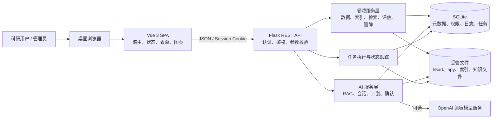
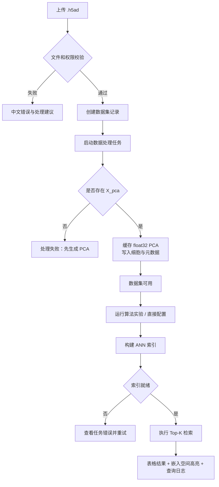
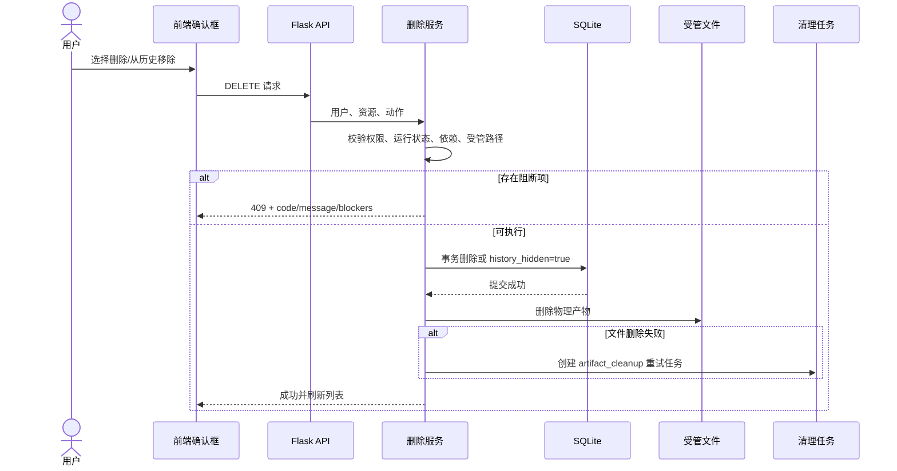
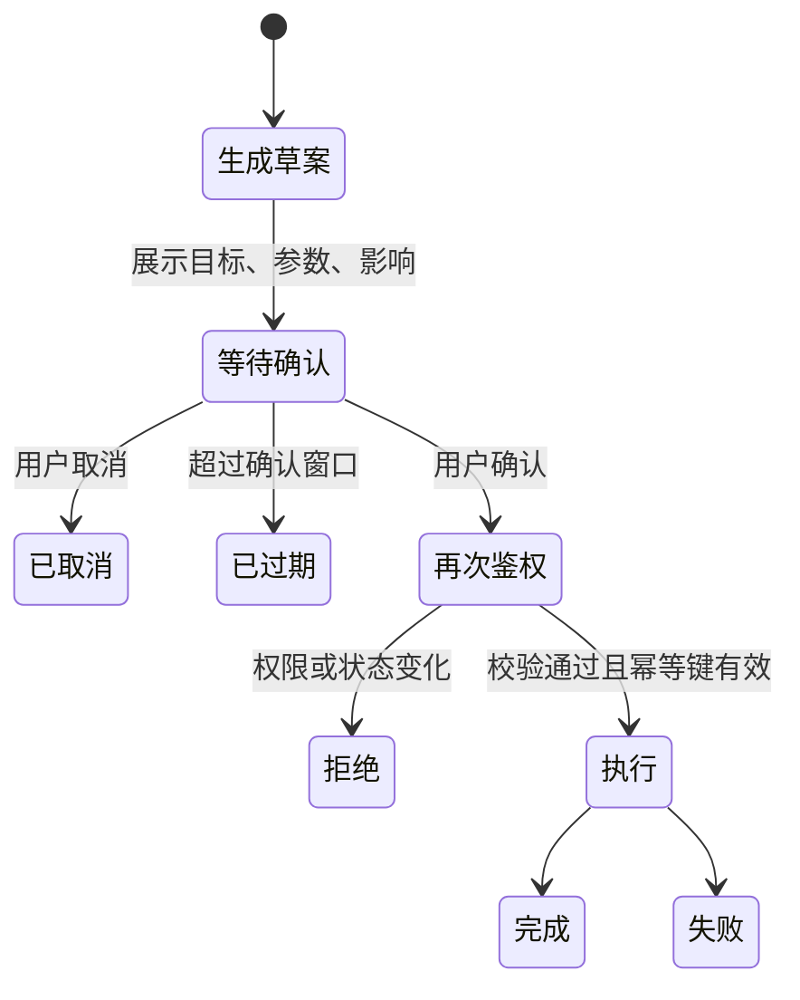
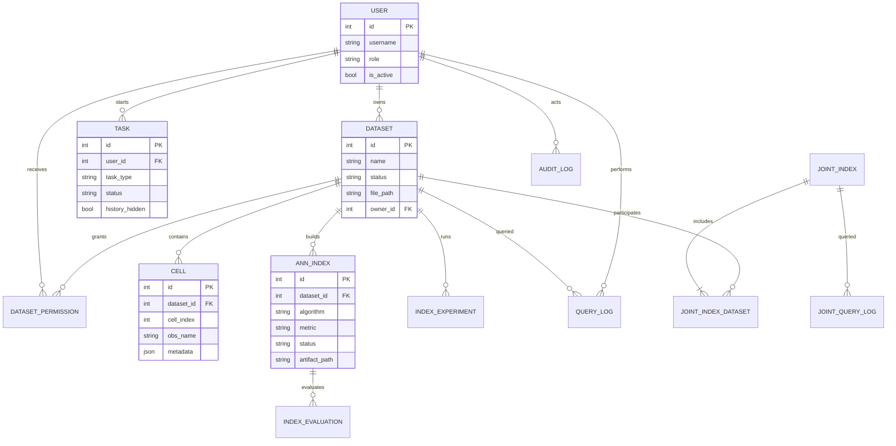
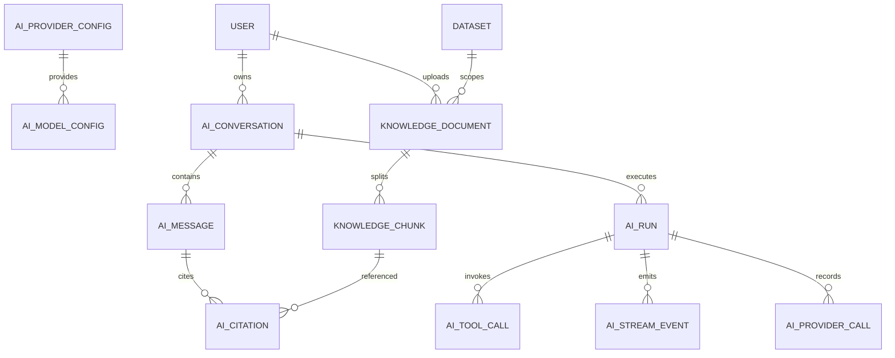

# 单细胞 ANN 检索研究平台开发文档

> 课程：软件工程  
> 项目名称：单细胞 ANN 检索研究平台（Single-Cell ANN Search）  
> 文档版本：V1.0  
> 编写日期：2026 年 7 月 11 日  
> 对应代码基线：`dev` 分支，提交 `6b8928c`  
> GitHub 仓库：<https://github.com/DING4526/SingleCell-Ann-Search>

---

## 文档信息

| 项目 | 内容 |
| --- | --- |
| 文档用途 | 结项开发文档、系统设计说明、测试报告与用户操作手册 |
| 目标读者 | 课程评审教师、项目组成员、系统管理员、科研用户 |
| 系统形态 | Flask REST API + Vue 3 单页应用 + SQLite/文件型科研数据 |
| 推荐运行方式 | 本地或受控内网环境部署，通过桌面端浏览器访问 |
| 适配基线 | 1366×768 最低基线，1440×900 常用基线；不做手机和平板专项适配 |
| 当前结论 | 课程演示与本地科研工作台场景可用；公网生产部署前仍需完成第 5.18 节的安全加固 |

> [!IMPORTANT]
> 本文档中的成员姓名、学号和最终贡献比例必须由项目组在提交前共同确认。仓库只能证明代码提交身份，不能替代课程要求的签字或群聊确认材料，因此未知信息均以“待填写”标记，没有进行推测。

## 修订记录

| 版本 | 日期 | 修订人 | 说明 |
| --- | --- | --- | --- |
| V1.0 | 2026-07-11 | 丁益三 / 项目组 | 按结项要求整合项目概述、设计、测试、管理和用户手册 |

## 目录

- [一、项目概述](#一项目概述)
- [二、需求分析与系统设计](#二需求分析与系统设计)
- [三、系统测试](#三系统测试)
- [四、项目管理](#四项目管理)
- [五、用户手册](#五用户手册)
- [附录](#附录)

---

# 一、项目概述

## 1.1 开发背景

单细胞转录组测序能够在细胞粒度观察组织异质性，但随着细胞数量从数千增长到数万乃至更大规模，研究者需要频繁执行“给定一个细胞，寻找表达特征相近细胞”的操作。直接对所有高维向量逐一计算距离，计算量会随数据规模增长；不同数据集之间还存在批次效应、特征空间不一致和权限边界等问题。

本项目面向课程实践与受控科研场景，构建一个可视化的单细胞近似最近邻检索平台。系统读取标准 `.h5ad` 数据，复用其中的 PCA 向量，建立 HNSW 或 FAISS 系列索引，支持单数据集检索、跨数据集 fan-out 检索和经 Harmony 对齐后的联合索引检索，并将结果叠加到 UMAP/PCA 二维空间中。平台同时提供实验评估、任务管理、数据访问控制、知识库和带确认机制的 AI 助手，使算法能力能够通过完整的产品流程被使用和审查。

## 1.2 项目目标

项目的总体目标是把单细胞 ANN 算法封装成可安装、可操作、可评估、可追踪的研究工作台。具体目标如下：

1. 支持 `.h5ad` 数据集上传、预处理、元数据浏览和二维嵌入可视化。
2. 支持 HNSW、随机投影 + HNSW、FAISS Flat、IVF-Flat 和 IVF-PQ 等候选算法。
3. 支持单数据集 Top-K、跨数据集 fan-out 和 Harmony 联合空间三种检索模式。
4. 提供召回率、平均时延、P95 时延、构建耗时、索引体积和加速比等实验指标。
5. 提供数据集级 Owner、Editor、Viewer 权限以及系统管理员能力，并保留审计日志。
6. 提供任务中心、结构化错误提示、安全删除和失败清理重试，避免科研资源无序堆积。
7. 提供平台知识、数据集知识和个人知识三类知识库，以及需要用户确认的 AI 操作草案。
8. 在 1366×768 与 1440×900 的 laptop 浏览器中保持专业、紧凑、无开发提示的交互体验。

## 1.3 项目范围与边界

### 1.3.1 已实现范围

- 用户登录、退出、账号状态管理与角色鉴权。
- 数据集上传、处理、查看、共享、转移所有权和删除。
- PCA 向量提取、细胞元数据入库、UMAP 或 PCA 二维展示。
- 普通 ANN 索引构建、算法实验、精度/性能评估和候选保留。
- 单数据集、fan-out 和联合索引检索。
- Harmony 联合空间构建与联合查询日志。
- 任务状态、异常信息、历史移除和清理重试。
- AI Provider/Model 管理、RAG 知识库、会话、流式事件和操作确认。
- 中文化、正式空状态/错误状态、404/503 页面和 laptop 端统一视觉规范。

### 1.3.2 不在本轮范围内

- 手机、平板和触屏手势的专项适配。
- 多机分布式计算、GPU 集群调度和跨节点索引分片。
- 公开互联网环境的一键生产部署。
- 原始测序矩阵的完整生信分析流水线；系统默认复用数据中的 `X_pca`。
- 对不同数据集检索结果给出生物学因果结论；平台只提供计算结果和辅助解释。
- 审计日志删除和历史记录恢复站。审计日志按设计永久保留，软移除记录默认不提供恢复入口。

## 1.4 开发与运行环境

### 1.4.1 技术栈

| 层次 | 技术 | 主要用途 |
| --- | --- | --- |
| 前端 | Vue 3、TypeScript、Vite、Pinia、Vue Router | 单页应用、状态管理、路由和构建 |
| UI | Ant Design Vue、自定义设计令牌 | 表格、表单、抽屉、确认框和统一视觉风格 |
| 可视化 | Plotly.js（散点相关模块按需加载） | UMAP/PCA 散点、悬停和点击交互 |
| 后端 | Flask、Flask-Login、Flask-SQLAlchemy | REST API、会话认证和 ORM |
| 数据 | SQLite、SQLAlchemy、文件存储 | 元数据、任务、权限、日志和科研文件 |
| 单细胞处理 | Scanpy、AnnData、NumPy、Pandas | `.h5ad` 读取、向量与元数据处理 |
| ANN | hnswlib、FAISS CPU、scikit-learn | 索引构建、查询、基准和随机投影 |
| 批次校正 | harmonypy | 联合空间 Harmony 对齐 |
| AI/RAG | OpenAI 兼容客户端、Pydantic、pypdf、cryptography | 模型调用、结构化计划、文档解析和密钥加密 |
| 测试 | pytest、Vitest、Vue Test Utils | 后端集成测试和前端组件测试 |

### 1.4.2 推荐环境

| 项目 | 推荐值 | 本次回归环境 |
| --- | --- | --- |
| 操作系统 | Windows 10/11、macOS 或 Linux | Windows NT 10.0.26200 |
| Python | 3.10 及以上，建议使用虚拟环境 | Python 3.13.1 |
| Node.js | 20.19+、22.12+ 或 24.x | Node.js 24.14.0 |
| npm | 与 Node.js 匹配的稳定版本 | npm 11.9.0 |
| Git | 2.x | Git 2.47.1 |
| 浏览器 | Chromium 内核桌面浏览器 | 1366×768、1440×900 为界面基线 |
| 内存/磁盘 | 取决于 `.h5ad`、向量和索引规模；建议预留数据文件数倍空间 | 课程样例数据可在普通 laptop 运行 |

## 1.5 可行性分析

### 1.5.1 技术可行性

AnnData/Scanpy 已形成成熟的单细胞数据交换生态，`.h5ad` 能同时存储表达矩阵、细胞注释和低维表示。hnswlib 与 FAISS 提供成熟的 CPU 近邻实现；Harmony 可用于多数据集低维空间批次校正。Flask 与 Vue 3 适合构建中等规模科研工具，既能快速开发，也方便将耗时任务与页面交互分离。上述技术均可本地安装，项目已经通过端到端测试验证核心流程，因此技术路线可行。

### 1.5.2 操作可行性

平台将算法参数组织为基础配置和专家配置；普通用户可按“上传—处理—实验—构建—检索”向导完成任务。长耗时操作进入任务中心，错误以中文信息和重试入口呈现。数据集、索引和检索结果都在统一导航内完成，不要求用户直接编写 Python 代码，操作成本可控。

### 1.5.3 经济可行性

核心依赖均为开源软件，课程环境可使用 SQLite、CPU 和本地磁盘，无需采购数据库或计算集群。可选 AI 功能可能产生第三方模型调用费用，系统支持按 Provider/Model 配置和用量统计；关闭 AI 功能不影响数据、索引与检索主流程。

### 1.5.4 安全与合规可行性

系统通过登录会话、系统角色、数据集级权限和审计日志控制访问；AI 上下文按用户可见范围组装，模型密钥可使用 Fernet 密钥加密。资源删除会先检查运行状态、依赖关系和受管路径。需要说明的是，课程演示配置不等同于公网生产配置：默认管理员、应用密钥、HTTPS、Cookie 策略、WSGI、备份和上传防护必须在部署前加固。

### 1.5.5 主要风险与应对

| 风险 | 影响 | 应对策略 |
| --- | --- | --- |
| 上传数据缺少 `X_pca` | 无法建立检索向量 | 上传前校验；处理失败时给出明确提示 |
| 数据集维度或距离度量不一致 | fan-out 结果不可比较 | 查询前验证兼容性并拒绝不合法组合 |
| 大数据绘图卡顿 | 页面交互下降 | 确定性抽样、Plotly 懒加载、真实点单轨迹渲染 |
| 索引参数不合理 | 召回率或速度不佳 | 先运行实验，比较 Recall、P95 等指标后再保留候选 |
| 删除文件与数据库状态不一致 | 孤儿记录或残留文件 | 数据库先提交，物理文件失败由持久化清理任务重试 |
| AI 生成错误操作 | 修改错误或越权 | 仅生成草案、权限校验、显式确认、过期和幂等控制 |
| SQLite 并发能力有限 | 多用户高并发受限 | 课程/小团队使用；生产规模迁移 PostgreSQL 并使用任务队列 |

## 1.6 项目计划

| 阶段 | 时间 | 主要工作 | 交付物 |
| --- | --- | --- | --- |
| 需求与基线 | 2026-05-30 至 2026-06-10 | 明确数据格式、检索场景、技术栈和仓库规范 | 需求草案、项目骨架、分支约定 |
| 核心开发 | 2026-06-11 至 2026-06-25 | 数据处理、ANN 索引、检索 API、基础前端 | 可运行主流程、样例数据 |
| 功能扩展 | 2026-06-26 至 2026-07-05 | 联合索引、评估、权限、AI 知识与助手 | 多模式检索、权限和 AI 模块 |
| 集成收敛 | 2026-07-06 至 2026-07-10 | 删除完整性、UI 统一、可视化交互、回归测试 | 发布候选版本、测试用例 |
| 文档与提交 | 2026-07-11 至 2026-07-12 | 完整开发文档、演示视频、贡献确认、打包提交 | 结项材料 |

---

# 二、需求分析与系统设计

## 2.1 用户与角色分析

系统同时存在系统级角色和数据集级角色，两者共同决定最终权限。

| 用户类型 | 主要诉求 | 典型权限 |
| --- | --- | --- |
| 未登录访问者 | 了解系统是否可访问 | 只能进入登录页；API 返回 401 |
| Viewer | 查看授权数据并执行检索 | 查看数据、索引、图表，运行查询 |
| Editor | 完成数据处理和实验工作 | Viewer 权限 + 处理、建索引、评估、维护相关知识 |
| Owner | 管理自己数据集的全生命周期 | Editor 权限 + 共享、转移所有权、永久删除 |
| 系统管理员 | 维护平台、账号、模型和平台知识 | 查看全部资源，停用账号，管理 Provider/Model，查看审计 |

规则说明：私有数据集只对 Owner、管理员和被明确授权的成员可见；共享数据集默认向普通用户提供 Viewer 权限。系统管理员不是数据库 ID 的展示角色，页面仍以名称和业务语义为主。

## 2.2 功能需求

| 编号 | 模块 | 功能需求 | 验收要点 |
| --- | --- | --- | --- |
| FR-01 | 认证 | 用户登录、退出、获取当前用户；停用账号不得继续使用 | 401 统一处理，退出后停止任务轮询 |
| FR-02 | 数据资源 | 上传 `.h5ad`、处理、查看统计与元数据、删除 | 状态明确，失败可重试，依赖存在时返回 409 |
| FR-03 | 可视化 | 展示 UMAP；缺少 UMAP 时使用 PCA 前两维 | 图可正常加载，悬停中文化，点击可看细胞详情 |
| FR-04 | 普通索引 | 选择算法、距离度量和参数构建索引 | 运行中有任务状态，完成后可检索或删除 |
| FR-05 | 算法实验 | 对候选配置进行重复实验、比较和保留 | 展示 Recall、时延、体积、构建耗时和建议 |
| FR-06 | 单数据集检索 | 以数据集内细胞为查询，返回 Top-K | 结果含排名、细胞、距离、元数据；可视化高亮 |
| FR-07 | fan-out 检索 | 同一查询向量发送到多个兼容索引并归并 | 校验向量维度/度量，结果标识来源数据集 |
| FR-08 | 联合索引 | 多数据集公共基因对齐、Harmony 校正、建索引 | 至少两个数据集，进度/错误清晰，联合图可用 |
| FR-09 | 权限 | 分享、修改成员角色、撤销、转移所有权 | Owner/Admin 才能管理，操作产生审计记录 |
| FR-10 | 任务 | 查看运行中、成功、失败任务；移除终态历史 | 运行中任务不可移除；清理失败可重试 |
| FR-11 | 删除 | 资源硬删除、历史软移除、账号停用、审计保留 | 按影响确认，结构化 blockers，不产生数据库孤儿 |
| FR-12 | AI 知识 | 上传 PDF/MD/TXT，按平台/数据集/个人范围检索 | 权限隔离，内置资料只读，处理中不可删除 |
| FR-13 | AI 助手 | 问答、导航、分析、受控操作草案 | 生成不等于执行，执行前显式确认且再次鉴权 |
| FR-14 | 管理 | Provider/Model 配置、用量、账号和审计 | 密钥不回显，账号停用而非删除，审计不可删除 |

## 2.3 非功能需求

### 2.3.1 易用性

- 全站业务状态、角色、算法和距离度量使用统一中文映射。
- 不直接展示数据库主键、路由键、Task ID 或原始 JSON；技术信息进入折叠“技术详情”。
- 主要页面在 1366px 宽度下不产生无意义的整页横向滚动。
- 表单提供必填、帮助、错误说明；高风险操作使用红色语义和影响确认。
- 加载、空、错误和无权限状态必须有明确下一步，不显示默认 `No data`。

### 2.3.2 性能

- 检索使用 ANN 索引，API 返回耗时并记录查询日志。
- 大规模散点采用真实点单轨迹与确定性抽样，避免为每个图例类别复制全量点。
- Plotly 作为懒加载独立块，首屏不阻塞于完整图表库。
- 耗时的数据处理、建索引、联合构建与清理通过任务状态呈现。

### 2.3.3 可靠性与一致性

- 每个 SQLite 连接启用外键约束，迁移后执行外键检查。
- 删除先做权限、依赖、运行状态和受管路径检查；数据库提交失败时不得删除文件。
- 文件删除失败写入持久化 `artifact_cleanup` 任务重试。
- 模式切换或图数据为空时清除旧图，避免把上一查询结果误认为当前结果。

### 2.3.4 安全性

- 所有业务 API 基于登录会话，服务端做最终权限判断。
- 上传文件限制扩展名、大小和存储路径；不得根据用户输入删除任意路径。
- AI 密钥使用环境中的加密密钥保护，页面仅显示掩码。
- 高风险 AI 操作具有草案、确认、过期、幂等和审计步骤。

### 2.3.5 可维护性

- 前端使用 TypeScript 类型、统一 API 客户端、状态映射和公共组件。
- 后端按 route/service/model 分层，算法通过注册表扩展。
- 数据库迁移为幂等启动逻辑，测试覆盖权限、删除、SPA 和 AI 流程。

## 2.4 总体架构设计

系统采用浏览器单页应用、Flask API、领域服务、SQLite 和受管文件目录组成的分层架构。



### 2.4.1 前端职责

- 提供 Overview、Datasets、Index Lab、Joint Indexes、Query Lab、Access、AI Knowledge 和 AI Assistant 页面。
- 维护登录状态、页面路由、任务轮询和错误恢复。
- 将业务状态转换为中文标签；组织表格、表单、抽屉和图表交互。
- 不把前端按钮显隐当作权限边界，所有修改仍由后端鉴权。

### 2.4.2 后端职责

- 提供会话认证、资源 API、权限判断和统一错误结构。
- 读取/校验 `.h5ad`，缓存向量，构建与加载 ANN 索引。
- 执行检索、实验、评估、联合空间构建和绘图数据组装。
- 管理删除事务、文件清理重试、审计和 AI 操作确认。

### 2.4.3 存储职责

- SQLite 保存结构化业务数据，不直接存储大体积向量和索引二进制。
- `data/raw` 保存上传的 `.h5ad`，`data/cache` 保存缓存向量，`data/indexes` 保存索引产物。
- 知识文件和解析产物使用受管目录，数据库只保存路径、范围、状态和引用。

## 2.5 模块设计

| 模块 | 主要组件/服务 | 输入 | 输出 |
| --- | --- | --- | --- |
| 认证与用户 | Auth API、Flask-Login、User | 用户名、密码、会话 | 当前用户、401、账号状态 |
| 数据处理 | Data Service、Dataset/Cell | `.h5ad`、数据集信息 | PCA 缓存、细胞元数据、统计信息 |
| ANN 后端 | Algorithm Registry、HNSW/FAISS Adapter | 向量、算法、度量、参数 | 索引文件、构建统计 |
| 实验评估 | Experiment/Evaluation Service | 候选配置、重复次数、样本 | Recall、时延、体积、建议 |
| 检索 | Single/Multi/Joint Search Service | 查询细胞、Top-K、过滤项 | 排名结果、耗时、查询日志 |
| 联合空间 | Joint Index Service | 多数据集、公共基因、Harmony 参数 | 对齐向量、联合 UMAP、联合索引 |
| 绘图 | Plot Service、PlotlyPanel | 嵌入、分类元数据、命中项 | `points + metadata.legend` 图表契约 |
| 权限审计 | Access Service、DatasetPermission、AuditLog | 用户、资源、动作 | 允许/拒绝、审计事件 |
| 删除清理 | Deletion Service、artifact_cleanup Task | 资源、依赖、文件路径 | 事务删除、409 blockers、清理重试 |
| AI/RAG | AI Service、Knowledge、Conversation、Run | 文档、问题、上下文、确认 | 引用、回答、操作草案、执行结果 |

## 2.6 关键业务流程设计

### 2.6.1 数据到检索的主流程



### 2.6.2 联合索引流程

1. 用户选择至少两个有权访问且可处理的数据集。
2. 服务端读取表达特征并求公共基因集合；公共基因不足时停止并说明原因。
3. 对各数据集执行归一化、对数变换、可变基因选择和 PCA。
4. 使用 Harmony 按数据集批次对齐低维空间。
5. 在联合向量空间生成 UMAP 展示坐标并建立 HNSW 索引。
6. 查询时，源细胞在同一联合空间内检索，结果保留数据集来源与细胞注释。

### 2.6.3 安全删除流程



该顺序保证“数据库提交失败时不删除文件”。数据集仍被联合索引引用、资源仍有运行任务、知识文档正在提取/索引、AI 会话存在运行任务等情况均返回结构化 409。

### 2.6.4 AI 操作确认流程



AI 不直接执行删除、权限/所有权变更、账号管理、模型密钥管理等高风险管理动作。

## 2.7 详细设计

### 2.7.1 数据输入与预处理

系统接收 AnnData `.h5ad` 文件。主检索流程要求 `adata.obsm["X_pca"]` 存在，并将其转换为连续的 `float32` 二维数组缓存。若存在 `adata.obsm["X_umap"]`，则用于二维展示；否则使用 PCA 前两维作为退化展示坐标。平台重点识别以下细胞注释：

| 字段 | 含义 | 用途 |
| --- | --- | --- |
| `cell_type` | 细胞类型 | 结果次信息、过滤、图例分类 |
| `disease` | 疾病/健康状态 | 元数据展示、图例着色 |
| `AgeGroup` | 年龄组 | 元数据展示、图例着色 |

其他 `obs` 字段作为扩展元数据序列化保存。细胞在页面中以“细胞编号 2,337”或原始观测名称展示，不直接暴露数据库主键。

### 2.7.2 ANN 算法抽象

算法注册表统一描述算法名称、支持的距离、类型化参数、构建函数和查询函数。当前支持：

| 算法 | 适用特点 | 关键参数示例 |
| --- | --- | --- |
| HNSW | 综合性能好，适合交互检索 | `M`、`ef_construction`、`ef_search` |
| Random Projection + HNSW | 先降维再构建 HNSW | 投影维度、随机种子、HNSW 参数 |
| FAISS Flat | 精确检索，适合基线对照 | 距离度量 |
| FAISS IVF-Flat | 倒排聚类近似检索 | `nlist`、`nprobe` |
| FAISS IVF-PQ | 压缩索引，适合体积对比 | `nlist`、`nprobe`、PQ 子空间参数 |

支持 `L2` 与余弦距离。索引参数存入技术详情，主列表只显示友好摘要。距离值越小通常表示在当前向量空间与度量下越相近，但不同算法、不同预处理或不同空间的距离不能直接横向解释为生物学相似度。

### 2.7.3 实验与推荐

算法实验允许对多个候选配置执行重复构建与查询，并与精确基线比较。核心指标定义如下：

- **Recall@K**：近似结果与精确 Top-K 的重合程度，越接近 1 越好。
- **平均查询时延**：多次查询耗时均值。
- **P95 查询时延**：95% 查询不超过的时延，更能反映尾部延迟。
- **构建耗时**：从向量加载到索引落盘的耗时。
- **索引体积**：索引产物文件大小。
- **加速比**：相对于精确基线的查询加速程度。

平台推荐口径为：Recall≥0.95 可作为高质量候选，0.90–0.95 可接受，0.80–0.90 仅建议研究验证，低于 0.80 不建议作为正式索引。该阈值是工程建议，不替代具体研究课题的统计标准。

### 2.7.4 检索与结果归并

- 单数据集检索：读取查询细胞向量，在指定索引内查询，支持细胞类型过滤。
- fan-out：同一查询向量发送到多个维度和度量兼容的活动索引，各自返回候选后统一按距离排序。
- 联合检索：查询细胞已在 Harmony 联合空间中拥有坐标，直接在联合索引查询，可返回其他数据集细胞。

统一结果表包含“排名、细胞、距离、元数据、操作”五列；数据集和细胞类型作为次级信息，不单独挤占大量横向空间。每次查询保存模式、耗时、结果摘要和用户，用于概览统计与历史查看。

### 2.7.5 图表数据契约

后端返回真实散点及统一图例元数据，概念结构如下：

```json
{
  "points": {
    "x": [0.1, 0.2],
    "y": [1.2, 1.5],
    "category": ["hepatocyte", "T cell"],
    "text": ["细胞编号 1", "细胞编号 2"],
    "highlighted": [true, false]
  },
  "metadata": {
    "legend": {
      "field": "cell_type",
      "items": [
        {"value": "hepatocyte", "color": "#2563eb", "count": 120}
      ]
    }
  }
}
```

前端使用一条 `Scattergl` 承载真实点，不再创建无法控制真实点的伪图例轨迹。紧凑图例放在工具栏弹层中：单击切换某类可见性，双击独显，点击“显示全部”复位。交互直接更新真实点的颜色和透明度。检索结果使用独立视觉层级高亮；无 payload 或切换检索模式时销毁旧图。

### 2.7.6 任务与状态机

耗时操作创建 Task 记录，常见业务状态统一映射为“等待中、运行中、已完成、失败、已取消”。前端登录后按需轮询；退出或收到 401 时立即停止。终态普通任务可“从历史移除”，运行中任务不可移除。`artifact_cleanup` 失败任务对管理员可见并允许重试，成功后自动隐藏。

## 2.8 API 设计

API 统一以 `/api` 为前缀，使用 JSON 响应和基于 Cookie 的登录会话。下表按领域列出主要接口；实际请求参数以代码类型和页面表单为准。

| 领域 | 主要接口示例 | 说明 |
| --- | --- | --- |
| 认证 | `/api/auth/login`、`/api/auth/logout`、`/api/auth/me` | 登录、退出、当前用户 |
| 数据集 | `/api/datasets`、`/api/datasets/{id}`、`.../process` | 列表、详情、上传、处理、删除 |
| 权限 | `/api/datasets/{id}/access`、`.../transfer` | 分享、角色修改、撤销、转移 |
| 算法/索引 | `/api/algorithms`、`/api/indexes`、`/api/datasets/{id}/indexes` | 算法目录、构建、列表、删除 |
| 实验评估 | `/api/index-experiments`、`/api/index-evaluations` | 候选实验、评估、历史移除 |
| 联合索引 | `/api/joint-indexes`、`/api/joint-indexes/{id}` | 构建、详情、删除 |
| 检索 | `/api/search`、`/api/search/fanout`、`/api/search/joint` | 三种检索模式 |
| 可视化 | 数据集 scatter、搜索 plot、joint plot、cell metadata 接口 | 二维点、图例、命中高亮、细胞详情 |
| 任务 | `/api/tasks`、`/api/tasks/{id}`、`DELETE /api/tasks?scope=terminal` | 状态、单条/批量历史移除 |
| 概览 | dashboard 统计接口 | 资源健康、索引、检索量、任务和最近记录 |
| AI 知识 | `/api/ai/knowledge/...` | 上传、解析、检索、重建、删除 |
| AI 会话 | `/api/ai/conversations/...`、runs/events/approval | 会话、运行、流事件、确认 |
| AI 管理 | `/api/ai/admin/providers/...`、models/usage | Provider、Model、用量 |

错误响应遵循业务可读结构：

```json
{
  "code": "RESOURCE_IN_USE",
  "message": "该数据集仍被联合索引使用，暂时不能删除。",
  "blockers": [
    {"type": "joint_index", "name": "肝脏联合索引"}
  ]
}
```

常用 HTTP 状态：400 参数错误、401 未登录、403 无权限、404 资源不存在、409 状态或依赖冲突、503 前端构建产物缺失/服务暂不可用。

## 2.9 数据库设计

### 2.9.1 设计原则

1. 结构化元数据进入 SQLite，大型二进制产物保存在受管文件目录。
2. 外键关系明确采用 `CASCADE`、`SET NULL` 或拒绝删除策略。
3. 实验、评估和普通任务用 `history_hidden` 软移除；审计日志不提供删除。
4. 数据集、普通索引、联合索引使用受控硬删除；用户账号使用停用。
5. AI Citation、StreamEvent、ProviderCall 等引用必须通过外键检查，迁移不得留下孤儿。

### 2.9.2 核心业务实体关系



### 2.9.3 AI 业务实体关系



### 2.9.4 主要数据表说明

| 表/模型 | 说明 | 删除策略 |
| --- | --- | --- |
| User | 用户、系统角色、启停状态 | 停用，不物理删除 |
| Dataset | 数据集、文件、状态、Owner | 有权限且无 blocker 时硬删除 |
| DatasetPermission | 用户对数据集的角色 | 随数据集级联；可单独撤销 |
| Cell | 细胞索引、名称和元数据 | 随数据集级联 |
| AnnIndex | 普通索引配置、状态、产物 | 硬删除并清理文件/相关日志 |
| IndexExperiment/Run | 候选实验和重复运行 | 从历史移除 |
| IndexEvaluation | 评估结果，可空索引引用 | 从历史移除；索引删除后引用置空 |
| JointIndex/JointIndexDataset | 联合空间及参与关系 | 联合索引可硬删除；关系级联 |
| QueryLog/JointQueryLog | 检索历史 | 相关资源删除时同步移除/隐藏 |
| Task | 异步/长任务和错误 | 终态可软移除，运行中保留 |
| AuditLog | 谁在何时做了什么 | 永久保留，不提供删除 |
| AiProviderConfig/AiModelConfig | 模型服务配置 | 有历史引用时优先停用 |
| KnowledgeDocument/Chunk | 知识文件、范围和分块 | 内置资料不可删；处理中拒绝删除 |
| AiConversation/... | 会话、消息、运行、工具与引用 | 运行中禁止删会话；其余按引用策略处理 |

## 2.10 UI 设计

### 2.10.1 设计原则

- 风格定位为专业、克制的科研工作台，不使用装饰性能力地图和开发验收口号。
- 左侧导航约 240px，顶栏只保留当前页面语义、任务和账号入口。
- 页面使用统一容器、指标卡、筛选工具栏、紧凑表格、分组表单和科学图表面板。
- 表格单元格横向留白约 12px，数字右对齐并使用等宽数字；名称列弹性伸缩，次信息放第二行。
- 低频操作进入统一“更多”菜单，危险操作统一用红色“删除”。
- 颜色只表达状态、分类和风险，不以高饱和装饰吸引注意。

### 2.10.2 信息架构

| 路由/页面 | 用户任务 | 关键信息 |
| --- | --- | --- |
| 概览 | 判断系统状态和下一步 | 资源健康、可用索引、检索量、任务、最近数据 |
| 数据资源 | 上传、处理和管理数据 | 状态、细胞量、向量、UMAP、权限、删除 |
| 索引实验室 | 比较算法并建索引 | 候选配置、实验指标、活动索引、历史 |
| 联合索引 | 构建跨数据集共享空间 | 参与数据集、公共基因、Harmony、状态 |
| 检索实验室 | 执行三类检索 | 查询上下文、Top-K、结果表、嵌入高亮 |
| 权限管理 | 分享、账号与审计 | 成员角色、所有权、账号状态、可读审计 |
| AI 知识库 | 维护 RAG 资料 | 资料范围、状态、只读/删除、检索 |
| AI 助手 | 问答、分析和受控操作 | 会话、引用、草案、确认、结果 |
| 404 | 处理无效地址 | 返回概览入口 |

### 2.10.3 页面状态规范

- **加载中**：使用骨架/局部 loading，不清空整个工作区。
- **空状态**：说明为什么为空，并给出“上传数据集”“创建索引”等行动按钮。
- **错误状态**：显示中文原因、可复制的技术详情和页内重试。
- **无权限**：说明需要的角色，引导联系 Owner/管理员，不展示无效操作。
- **离线/401**：统一提示会话失效，停止轮询并返回登录。
- **503**：缺少前端产物时显示正式服务不可用页面，不暴露 `npm install` 等开发命令。

## 2.11 权限与安全设计

### 2.11.1 权限判定

有效权限由系统角色、数据集可见性、所有权和显式成员角色共同计算。服务端在每个读写入口重新判断，前端仅根据能力结果隐藏无效操作。Owner 或管理员可共享、转移和删除；Editor 可处理、构建和评估；Viewer 只读并可检索。

### 2.11.2 审计设计

分享、撤权、转移所有权、账号停用、资源删除、模型配置等关键动作写入 AuditLog。页面展示可读事件标题、操作者、目标、时间和字段摘要，原始 JSON 仅位于技术详情。审计日志不可删除。

### 2.11.3 文件安全

- 只在受管根目录内保存和删除文件，删除前解析并验证规范绝对路径。
- 上传使用服务端生成的文件名，不直接信任客户端路径。
- 数据库事务成功后才清理物理文件，失败通过任务重试。
- 对外部署时应增加反向代理层上传限制、恶意文件扫描、磁盘配额和备份。

---

# 三、系统测试

## 3.1 测试目标与原则

测试重点是验证数据、索引、检索、权限、删除和 AI 等跨模块流程在真实数据库事务下能够协同工作，而不仅是检查单个函数返回值。本章所有“通过”结论均对应 2026 年 7 月 11 日 `dev@6b8928c` 的本地回归记录。

测试遵循以下原则：

1. 核心科学流程使用临时 `.h5ad`、临时数据库和真实索引文件测试。
2. 权限同时验证正常角色和越权角色，不能只依赖前端按钮显隐。
3. 删除同时验证数据库事务、外键、依赖阻断和物理文件顺序。
4. 前端重点测试状态映射、操作显隐、图表响应式更新和 AI 流事件归约。
5. 对未执行的负载测试、浏览器 E2E 和覆盖率不作虚假结论。

## 3.2 测试环境

| 项目 | 本次环境 |
| --- | --- |
| 操作系统 | Windows NT 10.0.26200 |
| Python / pytest | Python 3.13.1 / pytest 9.0.3 |
| Node.js / npm | Node.js 24.14.0 / npm 11.9.0 |
| 前端测试 | Vitest 4.1.10、Vue Test Utils 2.4.11 |
| 数据库 | 测试隔离 SQLite，外键开启 |
| 代码基线 | `dev`，`6b8928c` |

## 3.3 测试命令与结果

在项目根目录执行后端测试：

```powershell
..venv\Scripts\python.exe -m pytest -q
```

在 `frontend` 目录执行前端测试与静态检查：

```powershell
npm test -- --run
npm run typecheck
npm run build
```

本次结果如下：

| 检查项 | 结果 | 时间/补充 |
| --- | --- | --- |
| 后端 pytest | 55 passed | 本次直接回归 39.51 s |
| 前端 Vitest | 5 个测试文件、13 passed | 本次直接回归 16.95 s |
| TypeScript 类型检查 | 通过 | 未发现类型错误 |
| Vite 源码生产构建 | 通过 | 临时输出目录验证 3,774 个模块可打包 |
| Python 依赖一致性 | `pip check` 通过 | 无 broken requirements |
| 前端生产依赖审计 | 0 个已报告漏洞 | `npm audit --omit=dev`；不等于开发依赖或 Python CVE 审计 |

说明：当前工作目录直接重建 `frontend/dist/assets` 时曾遇到 Windows OS error 5（拒绝访问），而相同源码使用临时输出目录可以完成生产构建。这属于目录访问/占用环境问题，不是 TypeScript 或 Vite 源码失败。Windows 用户重建前应先停止正在运行的前端/后端服务，确认 `dist` 可写，再执行构建。

## 3.4 功能测试

### 3.4.1 后端测试覆盖

| 测试文件 | 数量 | 主要验证内容 | 结果 |
| --- | ---: | --- | --- |
| `test_data_service.py` | 3 | demo `.h5ad`、400×80 数据、20 维 PCA、二维 UMAP | 通过 |
| `test_ann_service.py` | 13 | HNSW 构建/查询/排除自身、cosine、算法注册、FAISS 往返、推荐门槛、清理路径边界 | 通过 |
| `test_spa_api.py` | 4 | 未登录边界、认证资源、处理→索引→实验/评估→检索→散点全链路、联合索引 | 通过 |
| `test_access_control.py` | 5 | 角色矩阵、任务可见性、共享/转移/审计、账号停用、最后管理员保护、SPA MIME | 通过 |
| `test_deletion_integrity.py` | 10 | 外键/迁移、503、孤儿修复、409 blocker、事务顺序、失败重试、级联与历史隐藏 | 通过 |
| AI integration | 5 | Provider、加密、Endpoint、JSON 兼容、推理重试、历史软删 | 通过 |
| AI stage 2 | 5 | 三级知识、计划、Embedding/中文、SSE 隔离、fan-out | 通过 |
| AI stage 3 | 10 | 脱敏、导航白名单、确认幂等、破坏性拒绝、流重放、证据引用 | 通过 |

### 3.4.2 前端测试覆盖

| 类别 | 数量 | 主要验证内容 | 结果 |
| --- | ---: | --- | --- |
| 格式化 | 2 | 数字、时间/状态等显示 | 通过 |
| 资源操作 | 2 | 操作显隐、业务能力判定 | 通过 |
| PlotlyPanel | 3 | 数据响应式更新、图例单击/双击和真实散点变化 | 通过 |
| Assistant Markdown | 3 | 助手内容安全渲染 | 通过 |
| AI SSE reducer | 3 | 流事件顺序与 UI 状态归约 | 通过 |

### 3.4.3 关键场景验收

| 场景 | 前置条件 | 操作 | 预期结果 | 状态 |
| --- | --- | --- | --- | --- |
| 登录保护 | 未登录 | 访问业务 API | 返回 401，前端进入登录 | 通过 |
| 数据处理 | `.h5ad` 含 `X_pca` | 上传并处理 | 写入向量、细胞和统计，状态“已处理” | 通过 |
| UMAP 退化 | 无 `X_umap`，有 `X_pca` | 打开详情图 | 使用 PCA 前两维，不影响检索 | 通过 |
| 索引查询 | ready/active 索引 | 查询 Top-K | 排除自身，返回有序结果与耗时 | 通过 |
| 检索高亮 | 查询结果存在 | 请求 plot task | 真实散点显示查询点和命中点，旧请求不串写 | 通过 |
| 联合检索 | 至少两个兼容数据集 | 构建并查询 | 在 Harmony 空间返回跨数据集结果和联合图 | 通过 |
| 权限拒绝 | Viewer | 处理、建索引或删除 | 服务端返回 403 | 通过 |
| 依赖删除 | 数据集仍在联合索引中 | 删除数据集 | 返回 409 和可读 blockers，文件不删 | 通过 |
| 事务失败 | 模拟数据库提交失败 | 删除文件型资源 | 数据库回滚，物理文件保留 | 通过 |
| 清理失败 | 模拟文件删除失败 | 完成资源删除 | 建立持久化清理任务，可重试 | 通过 |
| AI 高风险动作 | 让 AI 删除/改权限 | 提交请求 | 明确拒绝，不生成可执行工具调用 | 通过 |

## 3.5 性能测试与结果

### 3.5.1 测试方法

索引实验使用固定随机种子抽取查询样本，以 FAISS Flat 作为精确基线。每个候选在相同 Top-K、预热次数、重复次数和查询样本下运行，使用高精度计时器记录平均/P95 查询耗时，并保存 Recall@K、加速比、构建耗时和索引文件大小。该设计用于比较同一次实验中的候选，而不是声明跨机器 SLA。

### 3.5.2 当前本机实例对比

以下数据来自 2026 年 7 月 11 日本机 SQLite 实例中的实验记录，仅用于说明系统能够产出可解释的选型依据。测试对象为 `liver03`：69,032 个细胞、30 维向量、L2、Top-10、100 个查询样本、3 轮计时、10 次预热。精确 FAISS Flat 的平均查询耗时为 0.4976 ms、P95 为 1.0871 ms。

| 候选 | Recall@10 | 平均耗时 | P95 | 相对加速 | 构建耗时 | 索引体积 | 判定 |
| --- | ---: | ---: | ---: | ---: | ---: | ---: | --- |
| HNSW 快速（M=8） | 0.973 | 0.0225 ms | 0.0389 ms | 22.10× | 355.1 ms | 13.50 MiB | 最佳速度，可用 |
| HNSW 均衡（M=16） | 0.999 | 0.0663 ms | 0.0995 ms | 7.51× | 715.8 ms | 17.68 MiB | 最佳召回/综合 |
| HNSW 高召回（M=32） | 0.999 | 0.1298 ms | 0.1944 ms | 3.83× | 1,060.3 ms | 26.08 MiB | 高质量、成本较高 |
| RP-HNSW | 0.337 | 0.0342 ms | — | 14.55× | — | 11.90 MiB | Recall 不达标 |
| FAISS IVF-Flat | 0.724 | 0.0177 ms | — | 28.07× | — | 8.46 MiB | Recall 不达标 |
| FAISS IVF-PQ | 0.335 | 0.0185 ms | — | 26.87× | — | 0.76 MiB | Recall 不达标 |

本次数据表明：HNSW 均衡配置在该快照中质量与时延折中最好；速度更快或文件更小并不表示结果可用，必须同时满足召回门槛。由于没有记录 CPU、内存、系统负载、缓存状态和置信区间，这些数值不能泛化为生产环境性能承诺。

普通 QueryLog 的耗时包含从磁盘加载索引，而实验耗时是在索引已加载后测量，两者不可直接比较。联合索引记录中的 `build_time_ms` 只覆盖 HNSW `add_items`，不包含公共基因、归一化、PCA、Harmony、UMAP 与保存，因此本文不将其表述为联合构建总耗时。

### 3.5.3 前端体积与绘图控制

| 项目 | 构建结果 | 说明 |
| --- | ---: | --- |
| 主入口 JS | 284.73 kB / gzip 91.86 kB | 页面框架和公共逻辑 |
| Plotly 懒加载块 | 1,287.42 kB / gzip 437.04 kB | 首次打开图表时加载，不进入首屏主包 |
| 数据集图点数 | 最多 20,000 | 确定性抽样；分类统计仍基于全量 |
| 单检索背景点 | 默认 8,000 | 命中点与查询点优先保留 |
| 联合检索图点数 | 默认 12,000 | 控制 laptop 渲染压力 |

Plotly 块仍然较大，首次打开图表存在下载与解析成本；但使用懒加载、仅注册 ScatterGL 和单轨迹绘制后，不再阻塞普通列表与概览首屏。

## 3.6 缺陷、警告与测试边界

本次 pytest 通过但产生较多警告，主要是 Python 3.13 对 `datetime.utcnow()` 的弃用提示，另有 joblib 无法识别物理核心数的环境提示。这些不是本次测试失败，但应在后续升级中改用带时区时间对象并消除兼容警告。

当前尚未完成：

- pytest/Vitest 行覆盖率与分支覆盖率统计；
- Playwright/Cypress 浏览器自动化 E2E；
- 多用户并发、长时间稳定性、超大文件和磁盘耗尽测试；
- Safari/Firefox 跨浏览器、键盘可访问性和读屏测试；
- GitHub Actions 等持续集成流水线；
- 带完整硬件信息、负载控制和置信区间的生产基准。

因此本章结论是“课程演示和本地工作台核心流程回归通过”，而不是“达到公网生产 SLA”。

## 3.7 测试结论

在当前代码基线上，后端 55 项和前端 13 项自动化测试全部通过，类型检查与生产源码打包通过。数据处理、普通/联合索引、三类检索、嵌入图、权限、删除事务和 AI 确认链路均有自动化证据。尚存的主要工程风险是依赖版本未完全锁定、Python 弃用警告、无浏览器 E2E/CI 以及 SQLite + 进程内线程池的扩展上限。

---

# 四、项目管理

## 4.1 参与人员及分工

### 4.1.1 团队信息

| 成员 | 学号 | 项目角色 | 主要职责 | Git 证据 |
| --- | --- | --- | --- | --- |
| 丁益三 | **待填写** | 项目负责人 | 系统集成、路由与模型、Git 管理、代码审查、`dev` 集成、README/文档和发布材料 | `DING4526` / `DING`（同邮箱身份） |
| **成员 A 姓名待填写** | **待填写** | 算法与数据成员 | `.h5ad` 读取、PCA 缓存、ANN 索引、Top-K 检索和评估 | **待团队确认** |
| **成员 B 姓名待填写** | **待填写** | 前端与展示成员 | 页面、结果表格、Plotly 可视化和演示体验 | Git 账号 `Jarek125` 有成员 B 相关提交；真实姓名待确认 |

> [!WARNING]
> 提交前必须补全三名成员的姓名和学号。`Jarek125` 只能作为 Git 过程证据，仓库没有足够信息把该账号映射为某个真实姓名，也没有第三名成员可核验的 Git 身份。

### 4.1.2 最终贡献度确认

| 成员 | 建议填写方式 | 最终贡献比例 |
| --- | --- | ---: |
| 丁益三 | 结合需求、代码、集成、测试、文档和展示工作共同评议 | **待小组一致确认** |
| 成员 A | 结合数据/算法功能、测试与协作记录共同评议 | **待小组一致确认** |
| 成员 B | 结合前端、可视化、联调与展示工作共同评议 | **待小组一致确认** |
| 合计 | 必须等于 100% | **100%** |

Git 历史中 `dev` 可达提交约 35 个，其中丁益三对应身份约 30 个、Jarek125 约 5 个。提交数量受提交粒度、合并和集成方式影响，只能作为过程证据，不能直接换算为贡献比例。课程要求的贡献说明应附全体签字扫描件，或能够证明三人一致确认的聊天截图。

## 4.2 项目进度记录

| 日期 | 里程碑 | 可核验成果 |
| --- | --- | --- |
| 2026-05-30 | 项目建立 | 完成 Flask 基线、认证、数据处理、HNSW、检索、评估、Plotly、测试和 README；建立三人分工手册 |
| 2026-06-04 | 演示页面 | 成员 B 演示页面与亮色主题修复，通过 PR #1 合并 |
| 2026-06-06 至 06-07 | 异步与稳健性 | 静态资源修复；上传、处理、建索引、检索任务化；散点异步与缓存 |
| 2026-06-08 | 中期收敛 | 首页工作台与状态流、检索可视化升级；合并 PR #2/#3；标记 `v1.0.0` 中期版本 |
| 2026-07-09 | SPA 与权限 | Fan-out、参数保护、权限修复、Vue 3 SPA 中文化；检索结果与绘图任务拆分 |
| 2026-07-10 | 算法平台化 | 多算法实验、FAISS 基线、候选选优、Harmony 联合索引、协作权限和审计 |
| 2026-07-11 | 发布级收敛 | 多供应商 AI、RAG、统一助手、审批操作、删除完整性、Plotly/UMAP 稳定性和 UI 收敛 |
| 2026-07-12 | 计划提交 | 开发文档、演示视频、贡献确认、GitHub 链接和压缩包 |

## 4.3 分支与集成管理

项目使用 Git 和 GitHub 管理源代码，远程仓库为 <https://github.com/DING4526/SingleCell-Ann-Search>。

| 分支类型 | 用途 | 规则 |
| --- | --- | --- |
| `main` | 稳定演示/发布版本 | 只接收确认后的集成结果 |
| `dev` | 日常集成分支 | 功能完成后先合入并统一回归 |
| `feature/*` | 新功能 | 按模块开发，完成后发起合并 |
| `fix/*` | 缺陷修复 | 描述问题范围并附验证结果 |
| `docs/*` | 独立文档工作 | 避免与功能代码混杂时使用 |

历史中存在 PR #1、#2、#3 以及 `v1.0.0` 中期标签。最终开发代码已在撰写本文档前提交到 `dev`，提交为 `6b8928c feat: finalize release-ready research platform`。

建议提交信息采用 `feat:`、`fix:`、`docs:`、`test:`、`refactor:` 等前缀，正文说明“改了什么、为什么、如何验证”。合并前至少执行与改动相匹配的测试；跨模块改动由负责人进行集成审查。

## 4.4 项目管理工具

| 工具 | 实际用途 | 证据/说明 |
| --- | --- | --- |
| Git | 分支、提交、回滚边界和作者记录 | 仓库历史 |
| GitHub | 远程托管、PR 合并和版本标签 | 远程仓库、PR #1–#3、`v1.0.0` |
| Markdown 文档 | README、分工、AI 知识和发布检查 | `README.md`、`docs/` |
| pytest | 后端单元/集成回归 | `tests/`，55 项 |
| Vitest + Vue Test Utils | 前端逻辑与组件回归 | `frontend/src/**/__tests__`，13 项 |
| TypeScript/Vite | 类型检查和生产构建 | `npm run typecheck/build` |
| 发布阻断清单 | 区分课程演示与公网生产要求 | `docs/发布阻断清单.md` |

仓库中没有 CI 配置、Issue 模板、Projects 看板或 Jira/Trello 证据，本文档不声称实际使用这些工具。若提交材料需要“协作平台截图”，应由小组补充真实使用的群聊或会议记录。

## 4.5 质量与变更控制

1. 新功能先在独立分支完成，进入 `dev` 后执行集成回归。
2. 数据库结构调整采用幂等兼容升级，并要求外键检查为零。
3. 高风险删除必须增加权限矩阵、运行中 409、事务顺序和文件失败重试测试。
4. UI 收敛以 1366×768 和 1440×900 为验收基线，不扩大到移动端。
5. 发布前冻结功能范围，只处理阻断缺陷、文档和演示材料。
6. 公网部署项单列阻断，不以“课程本地可运行”替代安全评审。

## 4.6 风险管理

| 风险 | 监控信号 | 处理负责人 | 应对 |
| --- | --- | --- | --- |
| 数据格式不合规 | 处理任务提示缺少 PCA/读取失败 | 成员 A / 负责人 | 上传说明、样例文件、失败重试 |
| 算法质量不足 | Recall 低于门槛 | 成员 A | 候选对比、精确基线、只保留达标索引 |
| 前后端接口漂移 | 类型/集成测试失败 | 负责人 + 成员 B | 统一 API 客户端、集成回归 |
| 图表渲染失败 | 图表错误状态或旧图残留 | 成员 B | 懒加载、payload 清理、重试和组件测试 |
| 数据删除不完整 | FK 检查、残留文件、清理任务失败 | 负责人 | 结构化 blocker、事务顺序、持久化重试 |
| 生产配置泄露 | 默认密钥/账号仍存在 | 负责人/运维 | 按发布阻断清单逐项关闭 |
| 结项材料不完整 | 姓名学号、贡献证明、视频缺失 | 组长 | 提交前双人复核清单 |

## 4.7 项目交付物

| 交付物 | 状态 | 位置/动作 |
| --- | --- | --- |
| 完整前后端源代码 | 已完成 | GitHub 仓库与提交压缩包 |
| 安装运行说明 | 已完成 | `README.md` 与本文第 5.2–5.4 节 |
| 开发文档 | 已完成 | 本文件 |
| 自动化测试 | 已完成核心范围 | `tests/`、前端测试目录 |
| 发布阻断清单 | 已完成 | `docs/发布阻断清单.md` |
| 系统演示视频 | **待录制/待补链接** | 不讲代码，完整展示系统功能 |
| 成员贡献说明 | **待补全并共同确认** | 填写 4.1，附签字或群聊截图 |
| 邮件提交 | **待组长完成** | 按课程要求命名主题并在截止前发送 |

---

# 五、用户手册

## 5.1 手册说明

本章面向第一次接触平台的安装者、科研用户和管理员。普通用户可以从 5.5 节开始阅读；负责部署的人员应先完成 5.2–5.4；管理员还应阅读 5.14、5.17 和 5.18。

平台推荐使用 Chromium 内核桌面浏览器，最低界面基线为 1366×768，常用基线为 1440×900。系统未对手机和平板做专项适配。

### 5.1.1 最短使用路径

第一次完成检索可按以下顺序：

1. 登录平台。
2. 在“数据资源”上传含 `X_pca` 的 `.h5ad`。
3. 进入详情并点击“处理数据集”。
4. 到“索引实验室”运行候选实验，保留 1–3 个达标索引。
5. 到“检索实验室”选择单数据集模式，输入细胞编号和 Top-K。
6. 查看结果表和“嵌入空间高亮”，点击散点查看细胞详情。

如果只进行演示，可先运行 `scripts/create_demo_h5ad.py`，再上传生成的 demo 文件。

## 5.2 安装准备

### 5.2.1 软件要求

- Git 2.x。
- Python 3.10 及以上。
- Node.js 20.19+、22.12+ 或 24.x；当前 Vite 8 不再建议 Node 18。
- npm 与 Node.js 匹配。
- 可写磁盘目录。数据、向量和索引会同时占用空间，建议预留原 `.h5ad` 文件数倍空间。

### 5.2.2 获取项目

```powershell
git clone https://github.com/DING4526/SingleCell-Ann-Search.git
cd SingleCell-Ann-Search
git switch dev
```

如果使用课程提交压缩包，解压后直接进入项目根目录即可。

### 5.2.3 创建 Python 环境

PowerShell：

```powershell
python -m venv .venv
.\.venv\Scripts\Activate.ps1
python -m pip install --upgrade pip
pip install -r requirements.txt
```

也可使用 Conda：

```powershell
conda create -n sc-ann python=3.10
conda activate sc-ann
pip install -r requirements.txt
```

### 5.2.4 配置环境变量

复制示例配置：

```powershell
Copy-Item .env.example .env
```

至少替换 `.env` 中的 `SECRET_KEY`。需要配置 AI Provider 密钥时，还必须配置独立的 `AI_CREDENTIAL_ENCRYPTION_KEY`。可生成 Fernet 密钥：

```powershell
python -c "from cryptography.fernet import Fernet; print(Fernet.generate_key().decode())"
```

把输出写入 `.env`，不要提交到 Git，也不要把真实密钥放入截图或开发文档。默认应保持 `AI_ALLOW_PRIVATE_ENDPOINTS=false`；只有明确需要访问可信内网模型服务且了解 SSRF 风险时才调整。

## 5.3 首次初始化

在项目根目录、Python 虚拟环境已激活的情况下执行：

```powershell
python scripts/init_db.py
python scripts/seed_admin.py
python scripts/create_demo_h5ad.py
```

- `init_db.py`：创建/升级 SQLite 表并检查关系。
- `seed_admin.py`：创建课程演示管理员。
- `create_demo_h5ad.py`：可选，生成 `data/raw/demo_liver.h5ad`。

默认演示账号为 `admin / admin123`，只能用于本地首次启动。登录后应立即从右上角账号菜单修改密码。Demo 含 400 个细胞、80 个基因、20 维 PCA 和二维 UMAP，可用于验证上传、处理、索引与检索。

安装前端依赖：

```powershell
Set-Location frontend
npm ci
Set-Location ..
```

若没有 lockfile 才使用 `npm install`；本仓库已有 `package-lock.json`，`npm ci` 更利于复现。

## 5.4 启动与停止

### 5.4.1 演示/验收模式

先生成前端生产产物，再由 Flask 同源托管：

```powershell
Set-Location frontend
npm run build
Set-Location ..
python run.py
```

浏览器访问 <http://127.0.0.1:5000>。若 Windows 构建提示无法创建 `dist/assets`，先停止旧的 Python/Node 服务，确认 `frontend/dist` 可写后重试。

### 5.4.2 前端开发模式

打开两个终端。

终端 1：

```powershell
.\.venv\Scripts\Activate.ps1
python run.py
```

终端 2：

```powershell
Set-Location frontend
npm run dev
```

访问 <http://127.0.0.1:5173>。Vite 会把 `/api` 和 `/assets` 代理到 Flask 的 5000 端口。

### 5.4.3 正确停止

在运行服务的终端按 `Ctrl+C`。不要在建索引、联合构建或文件清理过程中直接强制结束进程；当前任务池位于应用进程内，进程终止会中断在途任务。重新启动后先在任务中心检查异常状态和清理重试项。

## 5.5 登录、账号与页面布局

### 5.5.1 登录与注册

1. 打开平台登录页。
2. 已有账号时输入用户名和密码，点击“登录”。
3. 允许自助注册时，可切换“创建账号”，填写用户名和至少 4 位密码。
4. 停用账号无法登录；其已有资源归属和审计历史不会被删除。

右上角账号菜单提供“修改密码”和“退出登录”。退出会清除会话并停止任务轮询；共享电脑使用后务必退出。

### 5.5.2 页面布局

- 左侧导航：概览、数据资源、索引实验室、联合索引、检索实验室、权限管理、AI 知识库、AI 助手。
- 顶部“任务”：打开任务中心，查看离开当前页面后仍在执行的工作。
- 顶部账号菜单：查看角色、修改密码、退出。
- 右下角 AI 入口：在非助手页面快速打开助手抽屉；AI 未启用时不会影响主功能。

### 5.5.3 概览页

概览用于回答“系统现在能做什么”和“下一步做什么”。页面展示：

- 数据资源健康情况和最近数据集；
- 可用普通/联合索引；
- 单数据集、fan-out、联合模式检索量；
- 进行中与异常任务；
- 最近任务和根据真实状态生成的下一步操作。

例如：无数据时建议上传；已有未处理数据时建议处理；数据可用但无索引时建议进入索引实验室；已有 ready 索引时建议开始检索。

## 5.6 数据资源

### 5.6.1 准备 `.h5ad`

最低要求：

- 文件扩展名为 `.h5ad`，平台上传上限为 3 GiB；该上限不表示普通 laptop 一定能稳定处理 3 GiB 文件。
- 必须包含二维 `adata.obsm["X_pca"]`，ANN 检索使用此向量。
- `adata.obsm["X_umap"]` 可选；缺失时仅影响展示方式，平台使用 PCA 前两维绘图。
- 推荐在 `adata.obs` 中提供 `cell_type`、`disease`、`AgeGroup`；字段大小写需一致。
- 其他 `obs` 字段会进入扩展元数据，但不保证全部成为专用筛选项。

上传前可在 Python 中检查：

```python
import scanpy as sc

adata = sc.read_h5ad("your_dataset.h5ad")
print(adata.shape)
print(adata.obsm.keys())
print(adata.obs.columns.tolist())
assert "X_pca" in adata.obsm
```

### 5.6.2 上传并处理

1. 打开“数据资源”，点击“上传数据集”。
2. 拖入或选择 `.h5ad` 文件。
3. 填写业务名称和说明；名称留空时可使用文件名。
4. 点击“上传并注册”。新数据默认私有，上传者为 Owner。
5. 进入数据集详情，核对文件与状态，点击“处理数据集”。
6. 在页面任务区域或顶部任务中心查看进度。
7. 成功后核对细胞数、基因数、PCA 维数、元数据统计和嵌入图。

处理会读取 `.h5ad`、把 PCA 转为 `float32` 缓存、重建细胞元数据，并异步生成散点缓存。处理失败时不要反复上传同一错误文件；先展开错误详情，修复 `X_pca`、文件损坏、内存或磁盘问题，再重试处理。

### 5.6.3 数据集详情

详情页包含：

- 摘要：业务名称、状态、所有者、可见性和说明；
- 规模：细胞数、基因数、向量维度；
- 嵌入图：UMAP 或 PCA 前两维；
- 索引：现用索引和状态；
- 任务：与当前数据集有关的处理、实验、构建和清理任务；
- 共享设置：Owner/Admin 可见；
- 危险操作：符合权限和依赖条件时显示永久删除。

### 5.6.4 使用 UMAP/PCA 图

处理成功后图表自动加载。具体交互：

1. 在图表工具栏选择“细胞类型”“疾病”或“年龄组”着色。
2. 打开紧凑图例，单击某类别可隐藏/重新显示；双击可只显示该类别。
3. 点击“显示全部”恢复全部类别。
4. 鼠标悬停查看细胞编号、类型、疾病、年龄组等中文信息。
5. 单击散点打开细胞详情；点击“检索此细胞”可带入检索实验室。
6. 使用工具栏平移、缩放、重置和导出图片。
7. 图表错误时点击“重新加载”。

大数据集最多确定性抽样展示 20,000 点，页面会区分“显示点数”和“总细胞数”；图例数量与统计基于全量数据。图表失败不代表数据处理或 ANN 索引失败。

### 5.6.5 删除数据集

仅 Owner/Admin 可永久删除。点击红色“删除”并阅读影响范围；确认后不可恢复。以下情况会阻止删除并列出 blocker：

- 存在运行中的处理、索引、实验、评估或相关任务；
- 存在 building 索引或未结束实验；
- 有正在处理的数据集知识文档；
- 数据集仍属于任意联合索引。

应先等待/处理任务、删除相关联合索引和依赖资源，再重试。删除不会先动原文件；数据库事务成功后才进入物理清理，失败会创建清理重试任务。

## 5.7 索引实验室

### 5.7.1 何时建立索引

数据集必须处于“已处理”，用户至少具有 Editor 权限。建议先运行统一候选实验，再选择达标候选，而不是盲目填写高级参数。

### 5.7.2 运行候选实验

1. 打开“索引实验室”。
2. 选择数据集和距离度量（L2 或余弦）。
3. 设置 Top-K、查询样本数、重复轮数和预热次数。
4. 保留默认候选，或在“专家配置”调整 2–12 个候选；原始 JSON 只用于专家编辑。
5. 点击“开始构建与评估”，到任务中心观察进度。

默认候选通常包括 HNSW 快速/均衡/高召回、RP-HNSW、FAISS IVF-Flat 和 IVF-PQ。FAISS Flat 是精确基线，不作为最终 ANN 候选。

### 5.7.3 看懂实验指标

| 指标 | 阅读方法 |
| --- | --- |
| Recall@K | 越接近 1 越好；反映近似结果与精确结果重合度 |
| 平均耗时 | 典型查询速度，越低越好 |
| P95 | 尾部时延，越低越稳定 |
| 加速比 | 大于 1 表示比精确基线快 |
| 构建耗时 | 建立索引的时间成本 |
| 索引体积 | 持久化占用，越小不等于质量越高 |

系统会标记最佳召回、最佳速度和最佳综合候选。Recall≥0.95 为高质量候选，0.90–0.95 可接受，0.80–0.90 仅建议研究验证，低于 0.80 不允许作为正式候选。

### 5.7.4 保留候选

1. 等待所有候选进入成功或失败终态。
2. 对比指标并勾选 1–3 个 Recall≥0.80 的候选。
3. 点击“确认保留并清理其他索引”。
4. 仔细阅读影响：选中候选变为 active/ready，未选候选及旧现用集合会被清理。

同一数据集存在运行中或待选优实验时不能启动重复实验。若决定不采用本次实验，先“放弃实验”；“从历史移除”仅隐藏记录，不等同于停止运行或删除索引。

### 5.7.5 记录操作

- **删除索引**：永久删除索引记录与文件，相关运行中评估/任务会阻止操作。
- **从历史移除实验**：软隐藏实验，不删除数据集。
- **从历史移除评估**：软隐藏评估；索引以后被删时，历史引用可置空。
- **技术详情**：查看算法原始参数、错误和 JSON；普通列表不显示数据库 ID。

## 5.8 联合索引

### 5.8.1 使用场景与前置条件

联合索引用于在经过公共基因和 Harmony 校正的统一空间中检索多个数据集。至少选择两个已处理数据集，并对每个数据集拥有 Editor 权限。不同数据集应具备足够公共基因和合理的批次标签。

### 5.8.2 构建步骤

1. 打开“联合索引”，点击“构建联合索引”。
2. 输入易识别的名称，选择至少两个数据集。
3. 选择距离度量和 PCA 维数。
4. 普通用户保留默认高级项；专家可调整高变基因数、最少公共基因、HNSW M、构建深度和检索深度。
5. 提交并在任务中心等待：公共基因对齐 → 标准化/高变基因 → PCA → Harmony → 联合 UMAP → HNSW。

数据集公共基因不足时可能被标记为“已跳过”；最终兼容数据集少于两个则构建失败。查看错误详情后调整数据集组合或公共基因阈值，不应直接把维度不兼容的独立 PCA 强行拼接。

### 5.8.3 权限与删除

用户必须能够查看联合索引包含的全部数据集，才可查看或查询联合索引。只有联合索引创建者或管理员可以删除；building 或有活动任务时禁止删除。删除联合索引不会删除任何源数据集。

## 5.9 检索实验室

### 5.9.1 通用规则

- 查询细胞编号从 0 开始，必须位于页面提示范围内。
- Top-K 为 1–100。
- 距离越小通常表示在当前索引空间更接近；不同空间/算法的距离不要直接比较。
- 结果表统一显示排名、细胞、距离、元数据和操作。
- 检索结果是计算相似性，不自动构成谱系、病理或因果结论。

### 5.9.2 单数据集检索

1. 选择“单数据集”。
2. 选择已处理数据集和 ready/active 索引。
3. 输入查询细胞编号、Top-K；按需选择细胞类型过滤。
4. 点击“运行检索”。结果表通常先出现，高亮图作为独立任务随后加载。
5. 结果中点击“详情”查看细胞元数据。

“嵌入空间高亮”会把查询细胞、命中细胞和背景点区分显示。切换模式或发起新查询时会清除旧图；如果表格已有结果而图仍加载中，请等待图任务或点击重试，不要把上一模式残图当作当前结果。

细胞类型过滤采用候选扩取后过滤；极稀有类型可能返回少于 Top-K，这不等于索引损坏。

### 5.9.3 fan-out 跨数据集检索

1. 选择“Fan-out”。
2. 选择源数据集、源索引和查询细胞。
3. 勾选多个目标数据集并设置 Top-K。
4. 系统为目标选择同距离度量、ready/active 且维度一致的普通索引，逐个检索后按距离归并。
5. 查看“已跳过”信息，确认是否有无权限、无兼容索引、维度不一致或读取失败。

fan-out 不提供统一 UMAP 高亮，因为各数据集没有经过统一空间校正。即使 PCA 维度相同，独立训练的嵌入也未必具有严格可比的生物学坐标；正式跨数据集分析优先使用联合索引。

### 5.9.4 联合索引检索

1. 选择“联合索引”。
2. 选择 ready 联合索引。
3. 选择该联合索引实际纳入的查询数据集。
4. 输入细胞编号和 Top-K，点击运行。
5. 查看 Harmony 空间中的结果表和联合 UMAP 高亮图。

联合结果标明来源数据集、细胞和元数据。Harmony 可降低批次差异，但结果仍依赖公共基因、参数与注释质量，需要结合研究设计验证。

### 5.9.5 图例与点交互

- 数据集图可按细胞类型、疾病、年龄组着色；搜索图按细胞类型，联合图可按数据集分类。
- 单击图例项切换某类；双击独显；“显示全部”复位。
- 操作会改变真实散点透明度/颜色，不只是改变图例外观。
- 悬停不显示 global label 等内部字段。
- 点击点打开细胞详情，可把该细胞继续带入检索。

### 5.9.6 检索历史

历史可按模式、人工/AI 来源和状态筛选。“载入结果”恢复已保存的参数与结果，不会重新执行 ANN；必要时只重新生成高亮图。“从历史移除”是软隐藏，不删除数据集和索引。

## 5.10 任务中心

顶部点击“任务”打开抽屉，可筛选全部、进行中和已结束任务。每条任务提供业务名称、状态、进度、创建时间和可读错误；技术 ID 和原始参数位于详情。

常见状态：

| 状态 | 含义 | 用户动作 |
| --- | --- | --- |
| 等待中 | 已排队，尚未执行 | 等待，避免重复提交 |
| 运行中 | 正在处理 | 可离开页面，但不要停止服务 |
| 已完成 | 业务完成 | 打开相关资源查看 |
| 失败 | 任务未完成 | 查看错误，修复原因后重试 |
| 已取消 | 未继续执行 | 根据需要重新发起 |

终态普通任务可“从历史移除”；运行中任务不可移除。物理清理失败任务必须先点击“重试清理”，成功后才会自动隐藏或允许清理历史。

## 5.11 权限管理

### 5.11.1 角色矩阵

| 能力 | Viewer | Editor | Owner | Admin |
| --- | :---: | :---: | :---: | :---: |
| 查看、统计和检索 | 是 | 是 | 是 | 是 |
| 处理数据、运行实验/评估、删除普通索引 | 否 | 是 | 是 | 是 |
| 使用数据构建联合索引 | 否 | 是 | 是 | 是 |
| 维护数据集知识 | 否 | 是 | 是 | 是 |
| 修改可见性和成员 | 否 | 否 | 是 | 是 |
| 转移所有权、删除数据集 | 否 | 否 | 是 | 是 |
| 管理账号、平台知识和 AI 模型 | 否 | 否 | 否 | 是 |

### 5.11.2 分享数据集

Owner/Admin 在数据集共享设置中可以：

1. 把私有数据改为“全员只读”；所有登录用户获得 Viewer。
2. 按用户名添加 Viewer 或 Editor。
3. 修改显式成员角色或撤销显式权限。
4. 转移所有权；转移立即生效，原 Owner 自动保留 Editor。

共享数据集中撤销某用户的显式 Viewer 后，该用户仍可能因“全员只读”拥有 Viewer，这是正常的有效权限计算。

### 5.11.3 用户与审计

管理员可创建用户、调整普通用户/管理员角色、停用账号、重置密码、配置 AI 可用性和限额。为避免无人管理，系统会保护最后一个有效管理员。用户不做物理删除，只停用。

Owner 可查看自己数据集的相关审计；Admin 可查看全局审计和 IP。审计事件使用可读标题和字段摘要，原始 JSON 在技术详情中；审计日志不提供删除。

## 5.12 AI 知识库

### 5.12.1 知识范围

| 范围 | 谁能查看 | 谁能维护 |
| --- | --- | --- |
| 平台知识 | 具有 AI 权限的用户 | 管理员 |
| 数据集知识 | 对数据集有查看权的用户 | 数据集 Editor/Owner/Admin |
| 个人知识 | 上传者本人 | 上传者本人 |

### 5.12.2 上传与索引

1. 打开“AI 知识库”，选择范围；数据集知识还需选择数据集。
2. 拖入 PDF、Markdown 或 TXT。默认单文件上限 25 MB，PDF 最多 500 页。
3. 等待“提取中—索引中—可用”。扫描版 PDF 暂无 OCR，必须包含可提取文字。
4. 使用“检索预览”输入关键词，检查命中的片段和来源。

系统始终可使用字符 n-gram/关键词检索；配置并测试成功 Embedding 模型后，可建立语义索引并融合排序。没有 Embedding 不等于知识库不可用。

内置资料标记为只读，不能删除；管理员可同步。普通资料可查看原文、重建索引或删除，但提取/索引进行中时禁止删除。

## 5.13 AI 助手

### 5.13.1 使用前提

管理员需要完成：配置 `AI_CREDENTIAL_ENCRYPTION_KEY`；新增 Provider 和 API Key；新增对话模型；测试成功并启用；开启系统和用户 AI 权限。无可选模型时联系管理员，主检索功能仍可正常使用。

### 5.13.2 普通问答

1. 从右下角打开助手，或进入“AI 助手”完整页面。
2. 选择模型，按需开启脱敏页面上下文。
3. 输入问题，点击发送或按 `Ctrl+Enter`。
4. 查看回答中的来源引用；可在同一会话继续追问。
5. 使用会话列表新建、切换或删除会话。运行中的会话不能删除。

建议问题：

- “解释 Recall@10 和 P95 的区别。”
- “我有一个已处理数据集，下一步如何建立可用索引？”
- “这次检索结果中主要有哪些细胞类型？”
- “为什么 fan-out 跳过了某个数据集？”

### 5.13.3 科学检索计划

当问题涉及实际检索时，助手先生成计划而不立即执行。用户可以检查或修改：模式、数据集、普通/联合索引、目标数据集、细胞编号、Top-K 和细胞类型过滤。点击“确认并执行”后才创建任务；取消不会产生查询。

同一会话中，只解释已有结果的追问可复用证据；修改数据集、索引、细胞或 Top-K 会要求重新确认。结果完成后可展开证据或跳转到检索实验室查看表格和图。

### 5.13.4 受控写操作

AI 可以提出处理数据集、构建索引、运行实验/评估、构建联合索引、重建知识索引和创建个人笔记等草案，但必须显示目标、参数和影响并由用户确认。草案约 10 分钟过期；确认时服务端重新鉴权，并使用幂等控制避免重复执行。

AI 不执行：永久删除、权限/所有权变更、账号管理、Provider/Model/密钥管理。涉及这些动作时必须由用户到正式管理页面手动完成。

## 5.14 AI 管理员配置

1. 进入权限/AI 管理区域，新增 Provider，填写 OpenAI-compatible Endpoint 和 API Key。
2. 保存后执行连接测试；密钥保存后只显示尾号掩码。
3. 新增对话或 Embedding 模型，关联 Provider。
4. 模型测试成功且 Provider 启用后，才向用户开放。
5. 在用量页查看调用次数和 Token 统计，按需设置用户每日限额。

Endpoint 默认要求公网 HTTPS，并拒绝 localhost、私网/保留 IP 与危险 DNS 解析。确有受控内网模型需求时再由运维配置允许项。Provider/Model 已被历史 Run、Chunk 或调用账本引用时不能直接删除，应停用以保留历史一致性。

## 5.15 删除、移除与停用

操作前必须区分：

- **永久删除**：删除业务资源及受管文件，不可恢复。
- **从历史移除**：设置历史隐藏，不删除科学资源，不提供回收站。
- **停用**：对象保留但不能继续使用，适用于用户及有历史引用的 AI 配置。
- **保留**：审计日志永久保留。

| 对象 | 策略 | 主要阻断条件 |
| --- | --- | --- |
| 数据集 | 永久删除 | 运行任务、构建/实验/评估、知识处理中、联合索引依赖 |
| 普通索引 | 永久删除 | building、活动实验/评估/任务 |
| 联合索引 | 永久删除 | building、活动任务 |
| 实验/评估 | 从历史移除 | 运行中不可移除 |
| 普通任务/检索历史 | 从历史移除 | 运行中或待清理不可移除 |
| 知识文档 | 永久删除 | 内置不可变、提取/索引中 |
| AI 会话 | 永久删除 | 存在活动 Run/关联任务 |
| 用户 | 停用 | 不提供物理删除 |
| Provider/Model | 有引用时停用 | 历史 Run/Chunk/调用引用 |
| 审计日志 | 保留 | 永不提供删除 |

收到 409 时阅读 `message` 和 blocker 列表，先解除依赖，不要手工删除 `data/` 文件或直接改 SQLite。

## 5.16 常见问题排查

| 现象 | 可能原因 | 处理方法 |
| --- | --- | --- |
| 页面显示 503 | 未生成 `frontend/dist` | 停止服务后进入 `frontend` 执行 `npm run build` |
| 修改前端后仍是旧页面 | 生产产物未重建/浏览器缓存 | 重建并强制刷新；开发时访问 5173 |
| PowerShell 不允许激活环境 | 当前会话执行策略限制 | 为当前会话设置合适策略，或使用 Conda |
| 5000/5173 端口占用 | 旧 Python/Node 仍运行 | 正常停止旧进程，或调整端口 |
| 处理失败：缺少 `X_pca` | AnnData 未保存 PCA | 用 Scanpy 生成 PCA 并重新保存 `.h5ad` |
| 没有 UMAP | 文件无 `X_umap` | 平台自动使用 PCA 前两维；不影响 ANN |
| UMAP 一直加载/报错 | 缓存生成或 Plotly 加载失败 | 点“重新加载”，检查任务错误、浏览器控制台和磁盘 |
| 表格有结果但高亮图未出现 | 绘图是独立异步任务 | 等待图任务；失败时重试，切换模式会清旧图 |
| 无法启动索引实验 | 数据未处理、权限不足或已有待选优实验 | 检查状态、Editor 权限，先结束/放弃旧实验 |
| 索引 Recall 很低 | 参数/投影不适合数据 | 选择 HNSW 均衡/高召回或增加搜索深度，重新实验 |
| fan-out 跳过数据集 | 无权限、无 ready 同度量索引或维度不一致 | 查看 skipped 原因，补索引或改用联合索引 |
| 联合构建失败 | 公共基因不足或兼容数据集不足两个 | 调整数据组合/阈值，核对基因命名 |
| 删除按钮不可用 | 权限不足或有依赖 blocker | 按提示完成/移除依赖，不手工删文件 |
| AI 没有模型 | Provider/Model 未测试启用或用户无权限 | 联系管理员完成 5.14 |
| PDF 无检索结果 | 扫描件无文本或仍在索引 | 使用可提取文字的 PDF，等待完成或重建 |
| 清理任务失败 | 文件被占用或权限不足 | 解除占用/修正目录权限，点击“重试清理” |

查看问题时优先保存：业务页面、发生时间、可读错误、操作步骤和相关资源名称。技术详情可用于组内排查，但对外截图前应去除文件路径、密钥尾号、用户名和研究数据。

## 5.17 备份与日常维护

### 5.17.1 备份

备份必须在停止写入后同时复制：

- `instance/` 中的 SQLite 数据库；
- `data/raw`、`data/cache`、`data/indexes` 和知识目录；
- `.env` 应由安全密钥系统单独备份，不与普通项目压缩包混放。

只备份数据库会丢失向量和索引文件，只备份 `data/` 会丢失权限、任务与路径引用。升级前应制作同批次备份，恢复后运行数据库初始化/兼容升级和外键检查。

### 5.17.2 维护建议

- 定期检查失败任务和 `artifact_cleanup`，不要任由残留文件增长。
- 定期查看磁盘空间、数据库备份是否可恢复、AI 用量和异常审计。
- 升级依赖前建立新虚拟环境并完整回归，不直接覆盖可演示环境。
- 当前后端多数依赖未完全锁版本，建议后续生成受验证的锁定清单。
- 不要通过文件管理器删除受管数据；所有删除从平台发起。

## 5.18 生产部署前必做

当前 `run.py` 使用 Flask 开发服务器，适合课程演示，不适合作为公网生产服务器。对外部署前至少完成：

1. 使用 Waitress/Gunicorn 等生产 WSGI，并关闭 debug/reloader。
2. 生成强随机 `SECRET_KEY` 与独立 AI 加密密钥，移除回退值。
3. 删除/停用默认 `admin / admin123`，创建独立管理员并启用强密码策略。
4. 配置 HTTPS、反向代理、安全 Cookie、可信 Host、上传体积与速率限制。
5. 将 SQLite/本地线程池按规模迁移为生产数据库和独立持久任务队列。
6. 配置日志轮转、监控、磁盘配额、告警和数据库+文件一致备份。
7. 审核模型 Endpoint、密钥权限、数据出境/隐私和供应商保留策略。
8. 做恢复演练、负载/长稳测试、浏览器 E2E 与安全扫描。

完整条目见 `docs/发布阻断清单.md`。在这些项目完成前，不应对外宣称系统已达到生产 SLA。

## 5.19 建议演示流程

结项视频不需要讲解代码，可按下列 8–12 分钟路径录制：

1. 登录并展示概览的真实指标和下一步建议。
2. 上传 demo `.h5ad`，处理并展示细胞/基因/PCA 信息。
3. 在数据详情切换 UMAP 着色，演示图例单击、双击、显示全部和点详情。
4. 进入索引实验室，展示候选指标、系统建议和保留现用索引。
5. 在检索实验室执行单数据集 Top-K，展示结果表与嵌入空间高亮。
6. 简要展示 fan-out 的目标归并与跳过信息。
7. 展示联合索引构建结果和 Harmony 联合查询。
8. 展示数据分享角色、任务中心和审计摘要。
9. 上传一份知识资料，使用 AI 助手引用回答；演示检索计划“确认后执行”。
10. 展示删除 blocker 与“从历史移除”的区别，不必真的删除核心演示数据。

录制前预先完成耗时构建并保留一组可用索引，同时准备一个短任务展示进度，避免视频长时间等待。

---

# 附录

## 附录 A：项目目录

```text
single-cell-ann-search/
├─ app/                    Flask 应用、模型、路由、任务和领域服务
│  ├─ ai/                  AI Provider、RAG、计划、SSE 与安全
│  ├─ routes/              业务 API、AI API、SPA 入口
│  └─ services/            数据、索引、检索、评估、绘图、权限、删除
├─ frontend/               Vue 3 + TypeScript SPA
│  ├─ src/components/      布局、图表与公共组件
│  ├─ src/views/           各业务页面
│  ├─ src/stores/          认证、数据、任务、检索状态
│  └─ src/services/        API、Plotly runtime、AI stream
├─ data/                   原文件、缓存、索引与知识产物
├─ instance/               本地 SQLite 数据库
├─ scripts/                初始化、管理员与 demo 脚本
├─ tests/                  后端测试
├─ docs/                   项目文档与发布清单
├─ requirements.txt        Python 依赖
├─ run.py                  本地演示入口
└─ README.md               快速说明
```

## 附录 B：状态与术语

| 术语 | 解释 |
| --- | --- |
| ANN | Approximate Nearest Neighbor，近似最近邻 |
| PCA | 主成分分析；本平台 ANN 的默认向量来源 |
| UMAP | 二维/低维展示坐标，不直接作为默认检索向量 |
| HNSW | 基于分层可导航小世界图的 ANN 方法 |
| FAISS | 相似度检索算法库，项目使用 CPU 后端 |
| Harmony | 多批次低维空间对齐方法 |
| Top-K | 返回距离最近的 K 个候选 |
| Recall@K | ANN Top-K 与精确 Top-K 的重合比例 |
| fan-out | 将一个查询向量分别发送到多个独立索引并归并 |
| ready/active | 页面中文显示为“可用/现用”的索引状态 |
| blocker | 阻止删除/修改的依赖或运行状态 |
| RAG | 先检索知识片段，再让模型基于证据回答 |

## 附录 C：结项提交前检查表

- [ ] 补全三名成员姓名和学号。
- [ ] 三人一致确认贡献比例，合计 100%。
- [ ] 附全体签字扫描件或群聊确认截图。
- [ ] 将最终代码推送到 GitHub，并确认仓库可访问。
- [ ] README 包含安装、运行和必要注释；开发文档包含 GitHub 链接。
- [ ] 源代码、开发文档和演示视频打包齐全。
- [ ] 视频完整展示系统，不需要逐段讲代码。
- [ ] 填写最终视频地址/文件名：**待填写**。
- [ ] 邮件主题按“【软件工程】第 X 组-组长姓名-组长学号-结项”填写。
- [ ] 组长在 7 月 12 日 24:00 前发送到课程指定邮箱。
- [ ] 提交前在另一台电脑解压并验证文档、视频和启动说明可用。

## 附录 D：待项目组补充的信息

| 信息 | 当前状态 |
| --- | --- |
| 小组编号 | 待填写 |
| 组长学号 | 待填写 |
| 成员 A 姓名/学号 | 待填写 |
| 成员 B 姓名/学号 | 待填写 |
| 最终贡献比例 | 待三人一致确认 |
| 贡献确认材料 | 待附签字或聊天截图 |
| 演示视频文件名/链接 | 待填写 |
| 正式部署地址 | 如无可写“本地演示，无公网地址” |

---

**文档结束**
